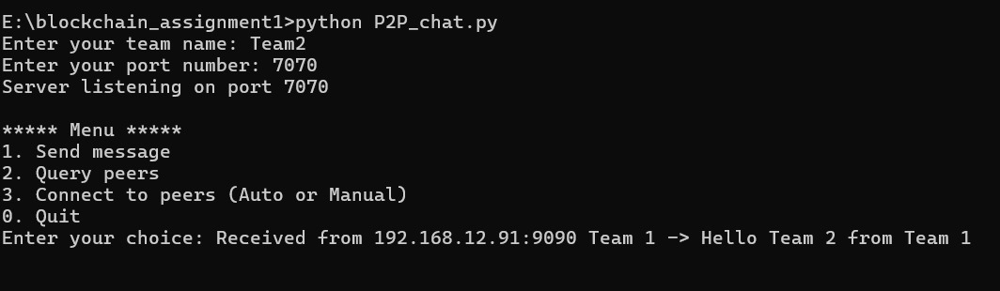
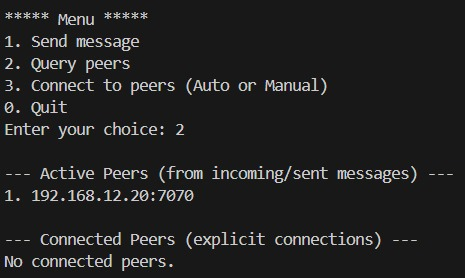
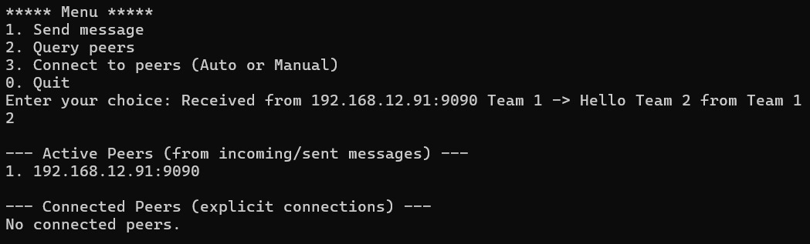
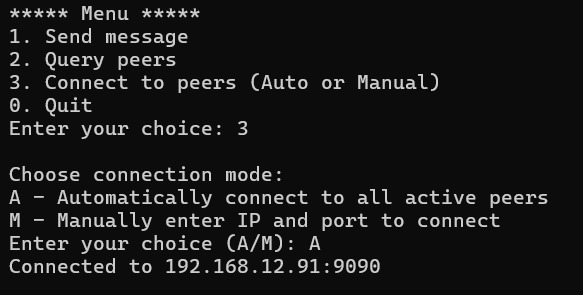
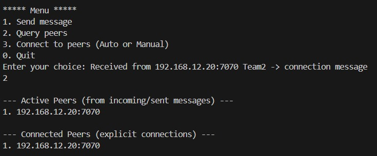
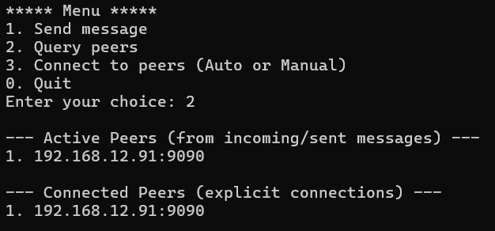
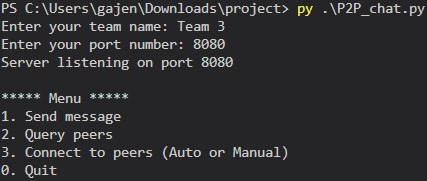
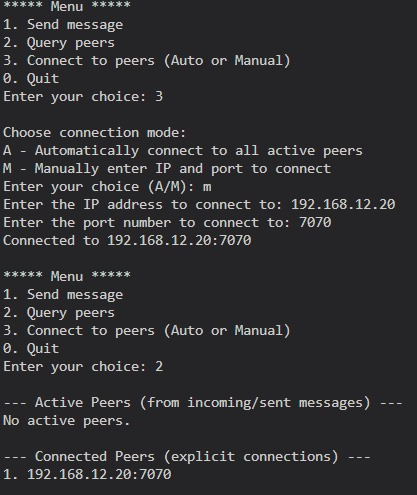
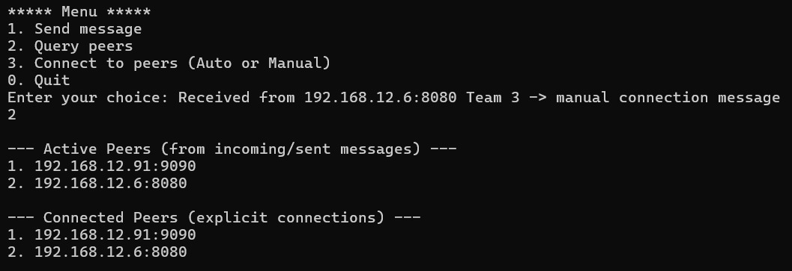
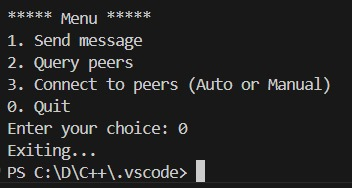

# Netech_CS216_P2P-Chat

This project implements a peer-to-peer (P2P) chat program in Python that supports simultaneous sending and receiving of messages. Each peer acts as both a client and a server. The application allows users to exchange messages, query active peers, and, as a bonus, explicitly establish connections with peers.


## Table of Contents

- Team Members
- #### **Bonus Implementation**
- Project Structure
- Overview
- Features
- Installation and Setup
- Usage Instructions - 
  - #### **IMPORTANT NOTE**
  - Run the Program
  - Interactive Menu
  - Exiting a Connection
- #### **Example Usage (With screenshots) -**
- Additional Features
-  Support

## Team Members

- Krishay Rathaure - Roll No: 230004026
- Jeel Savsani - Roll No: 230001033
- Gajendra Rana - Roll No: 230004016


## Bonus Implementation

- The bonus functionality has been successfully implemented. The connect_to_peers() function allows:
    -  Automatic Connection: Connects to all active peers.
    - Manual Connection: Prompts for a specific IP address and port number.
This feature ensures that explicit connections are established and maintained in the connected peers list.
## Project Structure ##
```bash
Netech_P2P-Chat/
├── P2P_chat.py       
├── README.md            
└── Other_images
  ```
## Overview

This program is designed to create a robust P2P chat network. It leverages socket programming and multi-threading in Python to enable non-blocking communication between multiple peers. Each message follows a standardized format to ensure consistency and easy parsing. The program also maintains two types of peer lists:
- **Active Peers:** Those from whom messages have been received or to whom messages have been sent.
- **Connected Peers:** Peers with whom an explicit connection has been established using the bonus connection functionality.
## Features

- **Simultaneous Send and Receive:** Uses separate threads to handle incoming connections and outgoing messages.
- **Standardized Message Format:** Every message includes the sender's listening port and team name.  
  _Example format:_  
  `LISTENING_PORT:<your_port>|TEAM_NAME:<your_team_name>|<your_message>`
- **Active Peer Management:**  Maintains an up-to-date list of active connections using data structures to store details (IP address, port, and socket file descriptor) for every peer that communicates with the system.
- **Explicit Peer Connection:** **(Bonus)** Allows users to automatically or manually connect to active peers, updating the connected peers list.
- **Dynamic Peer Discovery:** Supports querying for both active and connected peers.
- **Efficient I/O Management:**  
  Designed with the potential to use `select()` for managing file descriptors, ensuring that ready sockets are detected efficiently for non-blocking I/O operations.
- **Dynamic IP and Port Configuration:**  
  Users can input target IP addresses and port numbers at runtime, making the program highly adaptable for multi-host environments.
- **Automatic Connection Updates:**  
  As new clients connect and send messages, their details are automatically added to the active peer list, ensuring that the system always has the latest connection data.
- **Graceful Disconnection Handling:**  
  When a client sends an “exit” message, the program removes its details from the active list, ensuring only active peers are tracked.
- **Query Functionality:**  
  Implements a dedicated menu option to display the list of connected peers. Disconnected peers (those that have sent an “exit” message) are automatically filtered out.
- **Standardized Message Format:**  
  Every message is structured to include the sender's listening port and team name, ensuring accurate parsing and identification of the sender.

## Installation and Setup
1. **Prerequisites:**
   - Python 3.x
   - Standard Python libraries: `socket`, `threading`
2. **Clone the Repository:**
   ```bash
   git clone https://github.com/Quanmat/Netech_CS216_P2P-Chat.git
3. **Navigate to the Project Directory:**
 Open your terminal and navigate to the project directory: (Optional)
   ```bash 
   cd P2P_Chat
   ```
## Usage Instructions

- ## IMPORTANT NOTE -  
**Please make sure -   
  1 - All the systems(terminal) are connected to the SAME NETWORK.  
  2 - Windows FireWall is turned OFF, in these systems.**

- ### Run the Program
1. Open multiple terminal windows.
2. In each terminal, run the following command:   
- In Bash -
    ```bash
   python3 P2P_chat.py
   ``` 
- In Powershell - 
   ```bash
   py P2P_chat.py
   ``` 
   
3. When prompted, enter your team name (eg-Netech) and choose a unique port number for that peer.

- ### Interactive Menu

**Option 1 - Send Message:**  
Input the recipient’s IP address, port number, and your message. The message is sent in the format:  
```ruby
LISTENING_PORT:<your_port>|TEAM_NAME:Netech|<your_message>
```
**Option 2 - Query Peers:**  
Display lists of both active peers and explicitly connected peers. 

**Option 3 - Connect to Peers (Bonus):**  
Choose to automatically (A) or manually (M) establish connections with active peers.

**Option 0 - Quit:** 
Exit the application.

- ### Exiting a Connection ###

Sending the message " exit " will disconnect the peer from the current session and update the peer lists accordingly.


## Example Usage (With screenshots) - 

1. Let three Teams( 1, 2 and 3) run the program, with ports - 9090, 7070 and 8080 respectively. And then Team 1 sends a message to Team 2. 
   
    

2. Message received to Team 2- 

    

3. Quering on both teams - 
   Clearly shows the Active peers.( Note that they are NOT connected yet) - 

- Team 1 -   

   

- Team 2 - 

   

4.  **Showing Implementation of BONUS question -** 
   Using option  3 -> A  to automatically connect to all the active peers - 

   

5. Connection Message send to Team 1 - 
   
   
   
   Again quering Team 2 - 
   Clearly Showing Team 1 in the connected peers -

   

6. Checking Manual Connection - 
   Now Team 3 - 

   

   Team 3 connects to Team 1, manually using 3-> M.

   

   Message of manual connection, received to Team 1 and 
   again Quering Team 1- 
   Clearly shows Team 3 in the connected peers - 

   

7. Checking Exiting option- 
   
   

 


    


## Additional Features

- **IP Address Validation:**  
  The program checks whether the entered IP address is valid before attempting any connection. This ensures that only correctly formatted IPv4 addresses are accepted.

- **Graceful Disconnection:**  
  When a peer sends the message `"exit"`, the program automatically disconnects that peer and updates the active and connected peer lists accordingly.

- **Dual Peer Management:**  
  The application distinguishes between:
  - **Active Peers:** Peers from which messages have been received or to which messages have been sent.
  - **Connected Peers:** Peers with which an explicit connection has been established (via the bonus functionality).

- **Standardized Message Format:**  
  All messages follow the predefined syntax as specified in the problem statement, ensuring consistency and easy parsing. The message format is:  
  ```ruby
  LISTENING_PORT:<your_port>|TEAM_NAME:Netech|<your_message>

- Addional Comments in the code, for better understanding.
## Support

In case of any clarifiaction,
email any of the team members.

