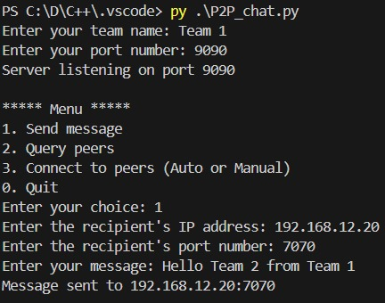

# Netech_CS216_P2P-Chat
CS 216 Project 1: Introduction to Blockchain P2P Chat Program - A Python-based peer-to-peer chat application demonstrating network programming and blockchain fundamentals. Built by Team Netech, this project features simultaneous message sending/receiving, dynamic peer discovery, and bonus functionality for explicit connection management.

